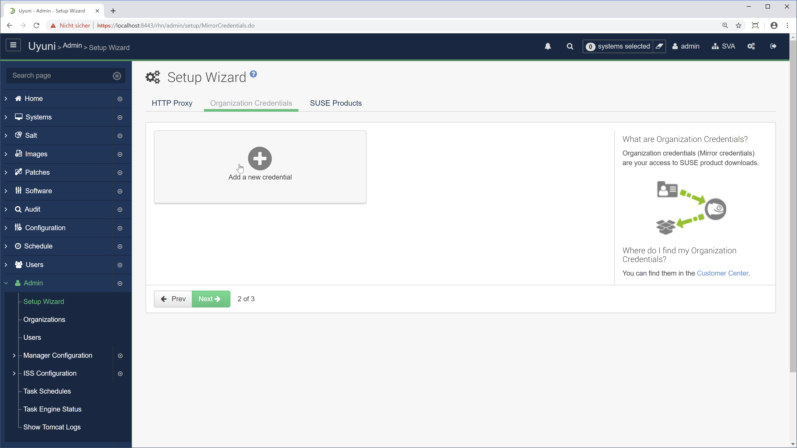
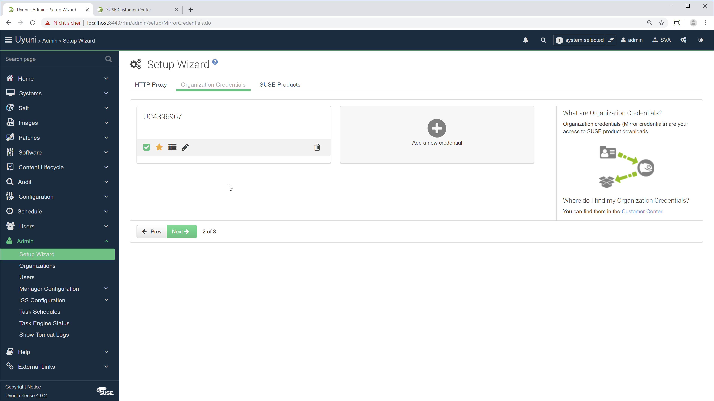

class: center, middle

# {{ title }}

## Untertitel

???

Notes for the _first_ slide!

---

{{ agenda }}

---

## Whoami


- Detlef Doge
- Zertifizierter Entschleunigungsbeauftragter

---

## Skills

- Twitter Bootstrap
- jQuery less
- GruntJS
- JSHint
- JSLint
- markdown
- sass
- jade
- coffeescript

---

# Motivation

Lorem ipsum dolor sit amet, consectetur adipisici elit, sed eiusmod tempor incidunt ut labore et dolore magna aliqua. Ut enim ad minim veniam, quis nostrud exercitation ullamco laboris nisi ut aliquid ex ea commodi consequat. Quis aute iure reprehenderit in voluptate velit esse cillum dolore eu fugiat nulla pariatur. Excepteur sint obcaecat cupiditat non proident, sunt in culpa qui officia deserunt mollit anim id est laborum.

---

# Thema A

## Untertitel

---

# Thema B

Hier folgt eine tolle Einführung

---

# Ergänzungen

Weitere Folien vermitteln weitere Zusammenhänge und Informationen..red[*]

.footnote[.red.bold[*] Fußnoten auch.]

--

## Noch mehr Informationen

Reicht dann jetzt auch mal.

---

# Code-Beispiel

Beispielhafte Implementation

```js
 import React, { useState } from 'react';
 function Example() {
   const [count, setCount] = useState(0);
   return (
     <div>
*     <p>You clicked {count} times</p>
*     <button onClick={() => setCount(count + 1)}>
     Click me
     </button></div>
   );
 }
```

(Man beachte die hervorgehobenen Zeilen 6 und 7)

---

## Beispiel in Bash

```bash
# Check what Linux we are on
uname -a
```

---

## Code-Beispiel

Elliot Alderson wäre stolz.


---

## Katzenbild


---

# Lab 01: Aufgabe

Beschreibung der Aufgabe

- Akzeptanzkriterium 1
- Akzeptanzkriterium 2
- Akzeptanzkriterium 3

---



---



---

# Linkliste

- Ein tolles Projekt: [[klick!]](https://github.com/stdevel/katprep/)
- Tolles Produkt-Benutzerhandbuch: [[klick!]](https://access.redhat.com/documentation/en-us/red_hat_satellite/6.5/)
- Tolleres Online-Forum: [[klick!]](https://community.icinga.com/)

---

class: center, middle

## Danke für die Aufmerksamkeit

### (jetzt bitte wieder aufwachen)


