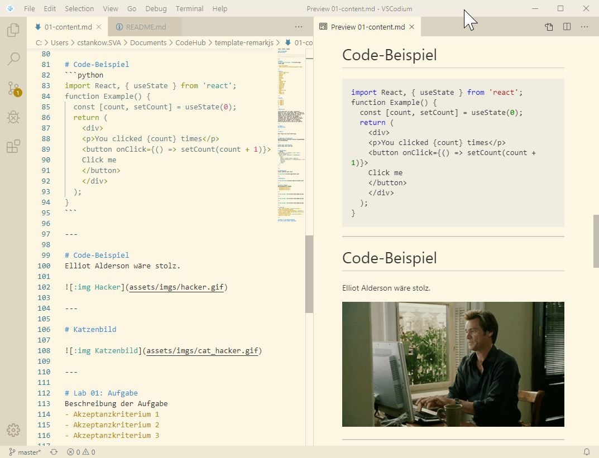
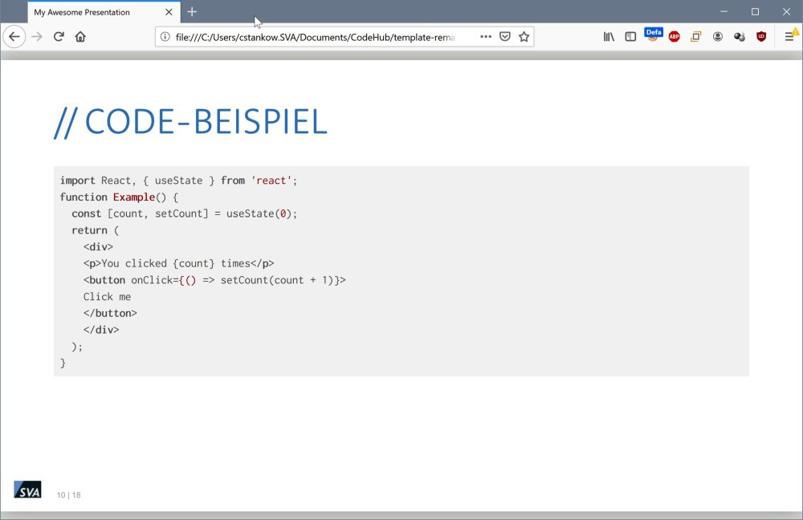

# training-as-code

This is a training template based on [remark.js (*v.0.15.0*)](https://github.com/gnab/remark). It is based on Markdown/JavaScript/HTML and offers the following advantages over conventional presentation software such as LibreOffice Impress and Microsoft PowerPoint:

- It only requires a web browser
- It also works on smartphones, tablets and other touch-optimized devices
- It can be used with version control systems such as **Git** as content is ``text/plain``
- You can use **any text editor** and operating system you like to create and display presentations
- It's **free** (*and hip!*)

## Automatic builds

When used in GitLab all Markdown documents (``*.md``) will be automatically build into a HTML presentation and PDF document which can then be downloaded as job artifact. This allows distributing your slides easily.

### Handout

A handout will be created from the file `handout.md`.
It has only basic styling applied to it.

## Usage

Clone this repository and have a look at the [example training (`01-content.md`)](01-content.md).
The format is markdown, you can leverage an editor such as [VSCodium](https://github.com/VSCodium/vscodium) and to edit the file and preview changes:




Check out the following websites for more information about Markdown:

- [https://www.markdowntutorial.com/](https://www.markdowntutorial.com/)
- [https://www.markdownguide.org/](https://www.markdownguide.org/)

You can also check-out the [official remark.js website](https://remarkjs.com) for further examples.

To manually create/update the HTML presentation, run the ``build.py`` utility. It requires having the Python module ``jinja2`` installed.

## Markdown macros

remark.js uses some Markdown, macros - e.g. for resizing images:

```markdown

```

The value before the colon represents an alternative text in case the image cannot be loaded. The value describes the image width in percentage.

New slides are defined by the following line:

```markdown
---
```

In order to add presentation notes, use the following code before the next slide:

```markdown
???

Notes
```

Incremental slides (*slides that add more information after a button press*) can be added with the following:

```markdown
This is already visible

--

This text will only be visible when going to the next element.

```

## Tweaks

### Set title

You can simply change the title by altering the [``settings.ini``](settings.ini) file:

```ini
[meta]
title=Zeit unproduktiv vergeuden leicht gemacht
```

### Change screen ratio

By default, the ratio **16:9** is selected, but you can also override this in [``settings.ini``](settings.ini) by changing the ``ratio`` line:

```ini
[layout]
ratio=4:3
```

### Set customer name as watermark

Before sending presentations to customers you can set their company name as watermark. To do so, edit [``settings.ini``](settings.ini):

```ini
[meta]
title=Zielgruppenorientierte Memes in Präsentationen
customer=Simone Giertz Ltd.
```

While the customer name could be removed from `presentation.html`, it can't be changed in the PDF version.

# Deploying lab environment

## Local

Ensure meeting the following requirements:

- Install [HashiCorp Vagrant](https://vagrantup.com)
- Install a supported hypervisor, such as:
  - [Oracle VirtualBox](https://virtualbox.org)
  - [VMware Workstation Player](https://www.vmware.com/products/workstation-player/workstation-player-evaluation.html), [VMware Workstation Pro](https://www.vmware.com/products/workstation-pro.html) or [VMware Fusion](https://www.vmware.com/products/fusion.html)
  - libvirt/KVM
  - [Parallels Desktop](https://www.parallels.com/)
  - [Microsoft Hyper-V](https://docs.microsoft.com/en-us/virtualization/hyper-v-on-windows/)

For deploying the lab on a local machine, simply clone this repository to a host and switch to the `Vagrant` folder. Run the following command to create and configure the VM:

```shell
$ vagrant up
Bringing machine 'default' up with 'virtualbox' provider...
==> default: Importing base box 'centos/8'...
==> default: Matching MAC address for NAT networking...
==> default: Checking if box 'centos/8' version '1905.1' is up to date...
...
PLAY RECAP *********************************************************************
default                    : ok=5    changed=3    unreachable=0    failed=0    skipped=0    rescued=0    ignored=0
```

## Cloud

For deploying the lab in the cloud, a provider-specific configuration needs to be created within the [`Terraform`](terraform/) folder.

Creating the environment differs per provider, but mostly the following commands are necessary:

```shell
$ terraform init
$ ssh-keygen -f clouduser
$ cp azureuser ../../Ansible/files
$ terraform plan -var-file=credentials-<name>.tfvars
$ terraform apply -var-file=credentials-<name>.tfvars
```

To configure the VMs using Ansible after creating the VMs, run the following commands:

```shell
$ ansible-playbook -i inventory.py ../../ansible/node.yml --flush-cache
```

# Testing

## VM customization

For the VM customization, unit tests can be found in the [`Ansible`](ansible/) folder. To run them, execute the following command within the VM:

```shell
$ pytest-3 /vagrant/ansible/test_generic.py
=== test session starts ===
platform linux -- Python 3.6.8, pytest-3.4.2, py-1.5.3, pluggy-0.6.0
rootdir: /vagrant/ansible, inifile:
plugins: testinfra-5.2.2
collected 3 items
test_generic.py ... [100%]

=== 3 passed in 0.09 seconds ===
```

When using a cloud environment, you can also leverage Ansible from your Terraform configuration to run the tests:

```shell
$ py.test --connection=ansible --ansible-inventory=inventory.py ../../Ansible/test_generic.py --sudo
```

Note that this will require **dynamic inventory**.

## Participant lab solution

Participants can easily check whether they succeeded a lab by running the following command:

```shell
$ lab 1
Checking lab 1

[1/2] Checking Good Task... Success!
[2/2] Checking Bad Task... Failure!

Errors in 1 task
```

`1` needs to be replaced with the lab number.

# Automated validation of lab solutions

Automated testing of lab solutions can be performed by placing test definition, written in [commander](https://github.com/SimonBaeumer/commander) syntax, in the `labs/test` directory.

When working with the example Vagrantfile in `vagrant`, the command `lab` becomes available inside the VM. Using it inside of the ``labs`` folder, which is placed inside the users home directory checks for either a single lab, or the whole suite can be performed. See ``lab -h`` for more information.

# Pipeline configuration

A [GitLab CI/CD](.gitlab-ci.yml) configuration is part of this repository. It executes the following tasks:

1. Render HTML from Markdown files
2. Build PDF presentation for sharing with participants
3. Create handout PDF from `handout.md`
4. Collect all the files necessary for a training (*presentations, additional content and handout*)

It should be easy to migrate this logic to other pipelines such as **GitHub Actions**.

# Further notes

See also the official [remark.js README](README-remarkjs.md) for more details.
